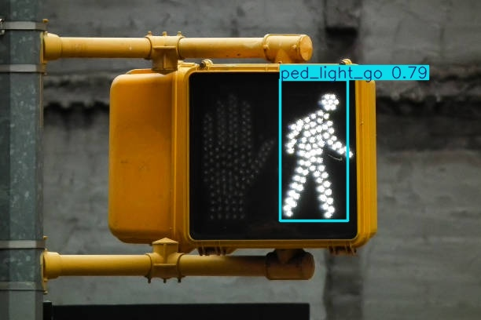
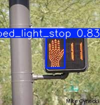

# UGV Autonomous Pedestrian Signal Detection (YOLOv8)
**High-Fidelity Deep Learning Model** designed for real-time interpretation of **American-Style Pedestrian Traffic Signals** within an **Unmanned Ground Vehicle (UGV) autonomy stack.**

---

### Project Objectives

* **Goal:** Develop a **robust** Computer Vision pipeline for UGV autonomous navigation, strictly focused on **Pedestrian Safety Compliance.**
* **Function:** Achieve real-time detection and classification of all critical road signals, addressing the unique challenge of differentiating and interpreting **Pedestrian WALK/DON'T WALK (GO/STOP) signals.**

### Methodology Highlights

* **Architecture:** Utilizes the **YOLOv8** object detection framework.
* **Data Strategy:** The model was trained using **two merged and annotated datasets** to ensure comprehensive coverage of unique **Pedestrian Signal iconography** (e.g., hand/walking figure) and environmental variability.

  
### Dataset Download Links

* https://universe.roboflow.com/gbglasses/gb_glasses
* https://universe.roboflow.com/merlimar-zt8am/auralvision

### Inference Results

Below are samples of the model running on unseen validation data:

**1. Pedestrian WALK Signal Detection**

**2. Pedestrian DON'T WALK Signal Detection**

**3. Combination Of Pedestrian WALK/DON'T WALK Signal Detectiong**

